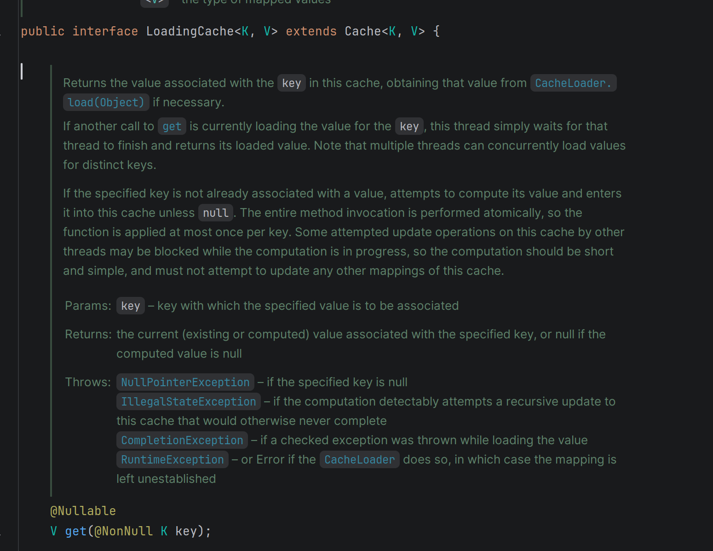
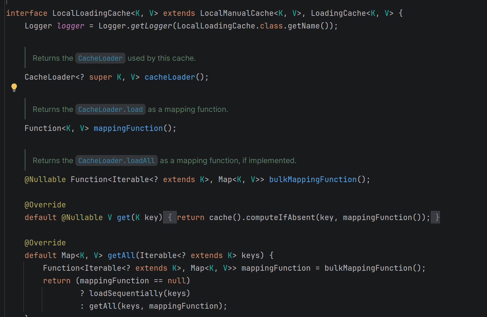
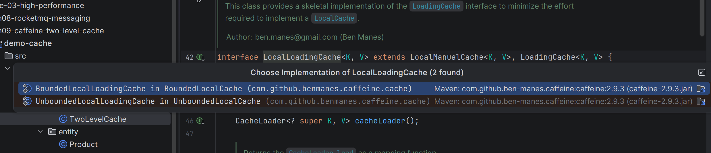
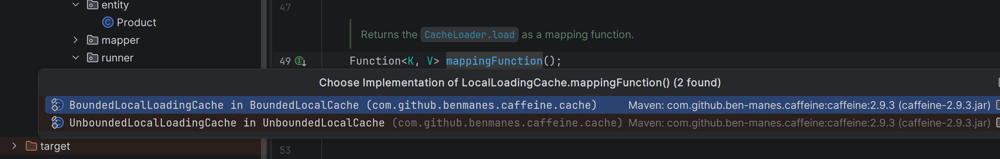
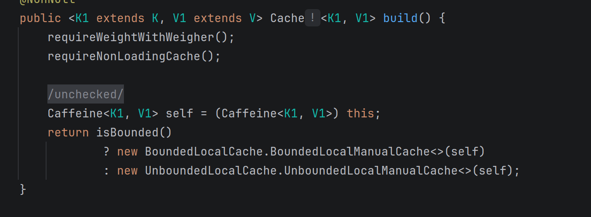

```java
public TwoLevelCache(int maxSize, long expireSeconds, long refreshSeconds,
                        StringRedisTemplate redisTemplate, ObjectMapper objectMapper,
                        String redisKeyPrefix, long redisTtlSeconds,
                        long nullTtlSeconds, JavaType valueType,
                        Function<String, V> sourceLoader) {
    this.redisTemplate = redisTemplate;
    this.objectMapper = objectMapper;
    this.redisKeyPrefix = redisKeyPrefix;
    this.redisTtlSeconds = redisTtlSeconds;
    this.nullTtlSeconds = nullTtlSeconds;
    this.valueType = valueType;

    // 构建Caffeine LoadingCache
    this.caffeineCache = Caffeine.newBuilder()
            .maximumSize(maxSize)
            .expireAfterWrite(expireSeconds, TimeUnit.SECONDS)
            .refreshAfterWrite(refreshSeconds, TimeUnit.SECONDS)
            .recordStats()
            .build(new CacheLoader<String, Object>() {
                @Override
                public Object load(String key) {
                    // 首次加载（缓存未命中）：Redis -> 回源
                    return loadFromRedisOrSource(key, sourceLoader);
                }

                @Override
                public Object reload(String key, Object oldValue) {
                    // 后台异步刷新：只查Redis，不回源
                    // Redis的数据新鲜度由外部定时任务保证
                    try {
                        Object fromRedis = loadFromRedisOnly(key);
                        return fromRedis != null ? fromRedis : oldValue;
                    } catch (Exception e) {
                        // Redis异常时返回旧值，不影响调用方
                        log.warn("两级缓存reload异常, key={}", key, e);
                        return oldValue;
                    }
                }
            });
}

/**
 * 查询缓存
 * <p>
 * Caffeine命中直接返回（纳秒级）。
 * 刷新间隔到期后，本次请求仍返回旧值，后台异步刷新。
 * LoadingCache保证同一key同一时刻只有一个线程执行加载，天然防止缓存击穿。
 * </p>
 */
@SuppressWarnings("unchecked")
public V get(String key) {
    Object value = caffeineCache.get(key);
    if (value == NULL_VALUE) {
        return null;
    }
    return (V) value;
}
```

## caffeineCache.get(key) 调用链分析

### 第1步：LoadingCache.get(key)

`caffeineCache` 的声明类型是 `LoadingCache<String, Object>`，这是一个接口，里面只有方法声明：

```java
// LoadingCache.java
public interface LoadingCache<K, V> extends Cache<K, V> {
    V get(K key);  // 只有声明，没有实现
}
```

</img>

### 第2步：LocalLoadingCache.get(key)

实际走到的是 `LocalLoadingCache` 接口里的 default 实现，内部通过 `mappingFunction()` 来加载数据：

```java
// LocalLoadingCache.java 第55行
interface LocalLoadingCache<K, V> extends LocalManualCache<K, V>, LoadingCache<K, V> {

    Function<K, V> mappingFunction();  // 接口方法，没有实现

    @Override
    default V get(K key) {
        return cache().computeIfAbsent(key, mappingFunction());
    }
}
```

</img>

### 第3步：computeIfAbsent

`computeIfAbsent` 也是继承自 `LocalCache<K, V>` 接口：

```java
interface LocalCache<K, V> extends ConcurrentMap<K, V> {
  @Override
  default @Nullable V computeIfAbsent(K key, Function<? super K, ? extends V> mappingFunction) {
    return computeIfAbsent(key, mappingFunction, /* recordStats */ true, /* recordLoad */ true);
  }
}
```

### 第4步：BoundedLocalLoadingCache

</img>
</img>

```java
static final class BoundedLocalLoadingCache<K, V>
      extends BoundedLocalManualCache<K, V> implements LocalLoadingCache<K, V> {
    private static final long serialVersionUID = 1;

    final Function<K, V> mappingFunction;
    @Nullable final Function<Iterable<? extends K>, Map<K, V>> bulkMappingFunction;

    BoundedLocalLoadingCache(Caffeine<K, V> builder, CacheLoader<? super K, V> loader) {
      super(builder, loader);
      requireNonNull(loader);
      mappingFunction = newMappingFunction(loader);
      bulkMappingFunction = newBulkMappingFunction(loader);
    }

    @Override
    @SuppressWarnings("NullAway")
    public CacheLoader<? super K, V> cacheLoader() {
      return cache.cacheLoader;
    }

    @Override
    public Function<K, V> mappingFunction() {
      return mappingFunction;
    }
}
```

### 第5步：newMappingFunction

这里可以自定义 `CacheLoader` 来设置加载规则：

```java
interface LocalLoadingCache<K, V> extends LocalManualCache<K, V>, LoadingCache<K, V> {
    /** Returns a mapping function that adapts to {@link CacheLoader#load}. */
    static <K, V> Function<K, V> newMappingFunction(CacheLoader<? super K, V> cacheLoader) {
        return key -> {
            try {
                return cacheLoader.load(key);  // 关键点
            } catch (RuntimeException e) {
                throw e;
            } catch (InterruptedException e) {
                Thread.currentThread().interrupt();
                throw new CompletionException(e);
            } catch (Exception e) {
                throw new CompletionException(e);
            }
        };
    }
}
```

### 第6步：isBounded 判断

`build()` 方法里会根据是否有边界条件来决定创建哪种 Cache：

```java
public <K1 extends K, V1 extends V> Cache<K1, V1> build() {
    requireWeightWithWeigher();
    requireNonLoadingCache();

    @SuppressWarnings("unchecked")
    Caffeine<K1, V1> self = (Caffeine<K1, V1>) this;
    return isBounded()
        ? new BoundedLocalCache.BoundedLocalManualCache<>(self)
        : new UnboundedLocalCache.UnboundedLocalManualCache<>(self);
}

boolean isBounded() {
    return (maximumSize != UNSET_INT)
        || (maximumWeight != UNSET_INT)
        || (expireAfterAccessNanos != UNSET_INT)
        || (expireAfterWriteNanos != UNSET_INT)
        || (expiry != null)
        || (keyStrength != null)
        || (valueStrength != null);
}
```

</img>

---

## 完整调用链路

```
【构造阶段】build(loader)
    │
    ▼
Caffeine.build(loader)                                    // Caffeine.java 第1066行
    │
    ├── isBounded() || refreshAfterWrite() 为 true
    │       │
    │       ▼
    │   new BoundedLocalLoadingCache(self, loader)         // 第1073行
    │       │
    │       ▼
    │   构造方法内部：                                       // BoundedLocalCache.java 第4450行
    │     mappingFunction = newMappingFunction(loader)     // 第4453行
    │       │
    │       ▼
    │     newMappingFunction 内部：                          // LocalLoadingCache.java 第180行
    │       return key -> cacheLoader.load(key)            // 第183行：把 loader.load() 包装成 Function
    │       │
    │       ▼
    │     Function 对象存到成员变量 mappingFunction
    │
    └── 否则
            │
            ▼
        new UnboundedLocalLoadingCache(self, loader)       // 第1074行（逻辑一样）


【运行阶段】caffeineCache.get(key)
    │
    ▼
第1步：LoadingCache.get(key)                               // 接口，只有声明
    │  → Ctrl+Alt+B 找实现
    ▼
第2步：LocalLoadingCache.get(key)                          // 第57行，default实现
    │  代码：cache().computeIfAbsent(key, mappingFunction())
    │
    │  mappingFunction() 是接口方法，返回值从哪来？
    │  → Ctrl+Alt+B 找实现
    ▼
第3步：BoundedLocalLoadingCache.mappingFunction()          // 第4464行
    │  return mappingFunction;                             // 第4465行：取出构造时存好的成员变量
    │
    │  拿到 Function 后，computeIfAbsent 判断：
    ├── key 存在 ──→ 直接返回缓存值（命中）
    │
    └── key 不存在 ──→ 执行 mappingFunction.apply(key)
            │
            ▼
第4步：newMappingFunction 内部的 lambda 执行
    │  cacheLoader.load(key)                               // 第183行
    │
    │  cacheLoader 是谁？→ 就是你 new CacheLoader(){...} 创建的匿名内部类
    ▼
第5步：load() 方法
    │  return loadFromRedisOrSource(key, sourceLoader)      // TwoLevelCache第87行
    │
    ├── 先查 Redis
    │     ├── Redis 命中 → 反序列化返回
    │     └── Redis 未命中 → 调用 sourceLoader 回源（查DB/RPC）
    │
    └── 结果回填到 Redis + Caffeine
```

---
