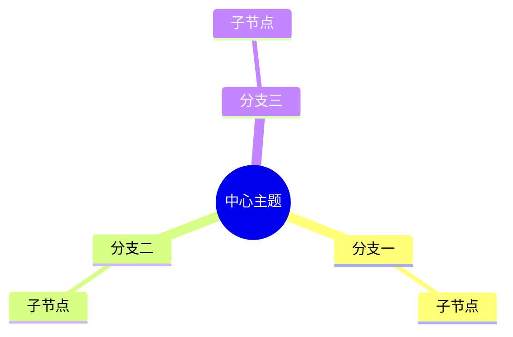

## 问题一：Mermaid 图表无法渲染

**问题**：文章中的 ````mermaid` 代码块只显示为代码，没有渲染成图表。

**解决方法**：在文章布局文件 `src/layouts/BlogPost.astro` 中添加 Mermaid 客户端渲染脚本：

```html
<script is:inline type="module">
	(async () => {
		const blocks = document.querySelectorAll('pre[data-language="mermaid"]');
		if (blocks.length === 0) return;

		const { default: mermaid } = await import('https://cdn.jsdelivr.net/npm/mermaid@11/dist/mermaid.esm.min.mjs');

		mermaid.initialize({
			startOnLoad: false,
			theme: 'default',
			securityLevel: 'loose',
			fontFamily: 'inherit',
		});

		for (const pre of blocks) {
			const graphDef = pre.textContent.trim();
			const id = 'mermaid-' + Math.random().toString(36).substring(2, 9);

			try {
				const { svg } = await mermaid.render(id, graphDef);
				const wrapper = document.createElement('div');
				wrapper.className = 'mermaid';
				wrapper.innerHTML = svg;
				pre.replaceWith(wrapper);
			} catch (err) {
				console.warn('Mermaid render error:', err);
			}
		}
	})();
</script>
```

注意选择器使用 `pre[data-language="mermaid"]`，因为 Astro 的 Shiki 高亮会将 mermaid 代码渲染为 `pre` 标签上的 `data-language` 属性。

---

## 问题二：GitHub Pages 内置 Jekyll 构建失败，收到报错邮件

**问题**：每次 `git push` 后收到邮件提示 "GitHub Pages 构建失败"，报错 `Invalid YAML front matter in ... BlogPost.astro`。

**原因**：GitHub Pages 默认使用 Jekyll 引擎构建，会尝试解析 `.astro` 文件导致失败。

**解决方法**：

**1. 将 Pages 构建类型改为 workflow**

```bash
gh api repos/<username>/<repo>/pages -X PUT -f build_type='workflow'
```

或在 GitHub 网页端：Settings → Pages → Source 选 GitHub Actions。

**2. 在仓库根目录添加 `.nojekyll` 空文件**

```bash
touch .nojekyll
```

**3. 在 `.github/workflows/deploy.yml` 的构建步骤中添加 `.nojekyll` 到 `dist/` 目录**

```yaml
      - name: Add .nojekyll
        run: touch dist/.nojekyll
```

---

## 问题三：Mermaid 图表渲染失败 — `Could not find a suitable point for the given distance`

**问题**：文章中的 `flowchart` 或 `graph` 图表在部署后显示 "Mermaid 渲染失败"，报错 `Could not find a suitable point for the given distance`。

**原因**：Mermaid v11 的布局引擎（dagre）在处理**多节点汇聚到同一目标**时，会因无法计算出合理的空间位置而报错。例如 6 个节点同时指向 1 个节点，或存在双层汇聚结构时。

**解决方法**：根据图的结构选择合适的语法类型：

### 方案一：将 `flowchart` 改为 `graph`

`flowchart` 是 Mermaid v11 的新布局引擎，对复杂结构兼容性较差。改为 `graph` 使用更稳定的 dagre 旧引擎：

```diff
- flowchart TD
+ graph TD
```

### 方案二：避免使用 `&` 合并语法

`&` 语法（如 `A & B & C --> D`）在多源汇聚时容易触发布局失败。改为逐条连线：

```diff
- A & B & C --> D["汇聚节点"]
+ A --> D["汇聚节点"]
+ B --> D["汇聚节点"]
+ C --> D["汇聚节点"]
```

### 方案三：多分支结构改用 `mindmap`

对于从中心向外辐射的树状/分支结构，`mindmap` 天然支持多分支展开，不需要布局引擎做复杂的路径计算：



### 方案四：避免节点文本中的特殊字符

节点文本中包含 `<div>`、`<script>` 等 HTML 标签或 `→` 箭头符号时，会导致 Mermaid 解析失败。改为纯文本描述：

```diff
- C["<div>用户输入</div>"]
+ C["div 标签内容"]

- B2["id=1001 → id=1002"]
+ B2["id=1001 改为 id=1002"]
```

### 方案五：复杂结构拆分为多张图

如果一张图包含 10+ 个节点且存在多层汇聚，建议拆为 2-3 张简单图，或用表格/列表替代。

---

## 问题四：Mermaid 渲染不稳定 — `svg element not in render tree`

**问题**：即使使用了上述修复方案，部分 Mermaid 图表（尤其是 `sequenceDiagram` 时序图）在部署后仍然渲染失败，报错 `svg element not in render tree`。

**原因**：Mermaid v11 的 `render()` API 要求文档中必须已存在一个具有目标 ID 的 DOM 元素，否则会抛出此错误。客户端渲染脚本需要在调用 `mermaid.render()` 前手动创建隐藏的容器元素。

**临时解决方法**：在渲染脚本中添加 DOM 节点创建逻辑：

```javascript
// 创建隐藏的容器
const container = document.createElement('div');
container.id = id;
container.style.display = 'none';
document.body.appendChild(container);

try {
    const { svg } = await mermaid.render(id, graphDef);
    // ... 渲染逻辑
} finally {
    container.remove(); // 清理容器
}
```

---

## 最终解决方案：全面转向手写 SVG 图表

### 为什么放弃 Mermaid

经过多次尝试，发现 Mermaid v11 在 Astro 博客环境中存在**根本性的渲染不稳定问题**：

1. **布局引擎 Bug**：`dagre` 引擎在处理多节点汇聚（6+ 节点指向同一目标）时必现 `Could not find a suitable point for the given distance` 错误
2. **DOM 依赖问题**：`render()` API 要求预先存在目标 DOM 元素，增加了渲染复杂度
3. **CDN 加载延迟**：从 CDN 异步加载 Mermaid 库可能触发竞态条件，导致部分图表渲染失败
4. **中文支持不稳定**：节点文本中的中文在部分情况下会出现排版错乱

### 最终方案

**将所有 Mermaid 图表替换为手写 SVG 文件**，彻底消除客户端渲染依赖。

### 实施步骤

#### 1. 创建 SVG 图表

在 `public/images/` 目录下创建手写 SVG 文件，例如：

```
public/images/
├── web-security-panorama.svg        # Web 安全漏洞全景图
├── sql-injection-flow.svg           # SQL 注入攻击时序图
├── xss-types.svg                    # XSS 三种类型对比
├── xss-context.svg                  # XSS 上下文与 Payload 构建
├── csrf-flow.svg                    # CSRF 攻击流程图
├── file-upload-chain.svg            # 文件上传攻击链与防御点
├── ssrf-attack.svg                  # SSRF 攻击场景
├── deserialization-flow.svg         # Java 反序列化攻击链
├── access-control-types.svg         # 访问控制违规类型
├── burp-suite-workflow.svg          # Burp Suite 核心工作流
└── http-security-headers.svg        # HTTP 安全响应头
```

#### 2. 修改文章内容

将文章中的 Mermaid 代码块替换为 SVG 图片引用：

```diff
- ```mermaid
- graph TD
-     A[用户输入] --> B{验证}
- ```

+ 
```

#### 3. 移除 Mermaid 渲染脚本

从 `src/layouts/BlogPost.astro` 中删除整个 Mermaid 客户端渲染脚本：

```diff
- <script is:inline type="module">
-     (async () => {
-         const blocks = document.querySelectorAll('pre[data-language="mermaid"]');
-         // ... Mermaid 渲染逻辑
-     })();
- </script>
```

保留 `.prose .mermaid` 的 CSS 样式（向后兼容），但移除 `.mermaid-loading` 相关样式和动画。

### SVG 设计规范

#### 配色方案（学术论文风格）

| 元素类型 | 填充色 | 边框色 | 文字色 |
|---------|--------|--------|--------|
| 处理场景 | `#dbeafe`（浅蓝） | `#3b82f6`（蓝） | `#1e40af`（深蓝） |
| 漏洞类型 | `#fef2f2`（浅红） | `#ef4444`（红） | `#991b1b`（深红） |
| 攻击者/安全状态 | `#f0fdf4`（浅绿） | `#22c55e`（绿） | `#166534`（深绿） |
| 中心节点/标题 | - | `#1e40af`（深蓝） | `#1e40af`（深蓝） |

#### 字体与排版

- **字体**：优先使用系统默认中文字体（`system-ui`, `-apple-system`, `sans-serif`）
- **字号**：标题 14-16px，正文 12px，标注 11px
- **文字**：尽量使用中文，避免技术缩写，确保可读性

#### 图形风格

- **顶会论文风格**：简洁的线条、规整的矩形/圆角矩形、清晰的箭头
- **拟人化风格**（可选）：手绘线条效果，适合非正式场景
- **一致性**：同一篇文章中的所有 SVG 使用统一的配色和排版规则

### 优势对比

| 维度 | Mermaid 客户端渲染 | 手写 SVG |
|------|-------------------|---------|
| **可靠性** | 不稳定，布局引擎存在 Bug | 100% 可靠，零渲染失败 |
| **加载速度** | 需要加载 CDN 库（~500KB） | 直接加载 SVG（~5-20KB） |
| **中文支持** | 部分情况下排版错乱 | 完美支持 |
| **自定义程度** | 受限于 Mermaid 语法 | 完全自由，可实现任何设计 |
| **维护成本** | 需要处理各种渲染错误 | 一次编写，永久有效 |
| **SEO 友好** | 搜索引擎无法索引图表内容 | SVG 文本可被搜索引擎索引 |

### 经验总结

1. **对于简单图表**（少于 10 个节点，无复杂汇聚），Mermaid 仍然可用，但需要做好错误处理
2. **对于复杂图表**（多节点汇聚、时序图、全景图），强烈建议直接使用 SVG，避免反复调试 Mermaid
3. **SVG 手写并不困难**：使用标准的 `<rect>`、`<text>`、`<path>`、`<line>` 等元素，配合合理的坐标系规划，可以快速构建专业级图表
4. **保留 Mermaid 源码注释**：在替换为 SVG 时，可以在图片下方保留原始 Mermaid 代码作为注释（使用 HTML 注释），方便后续修改

### 参考资源

- [SVG 官方文档](https://developer.mozilla.org/zh-CN/docs/Web/SVG)
- [Mermaid 官方文档](https://mermaid.js.org/)
- [学术论文图表绘制指南](https://www.nature.com/nature-portfolio/authors/policies/figures)
