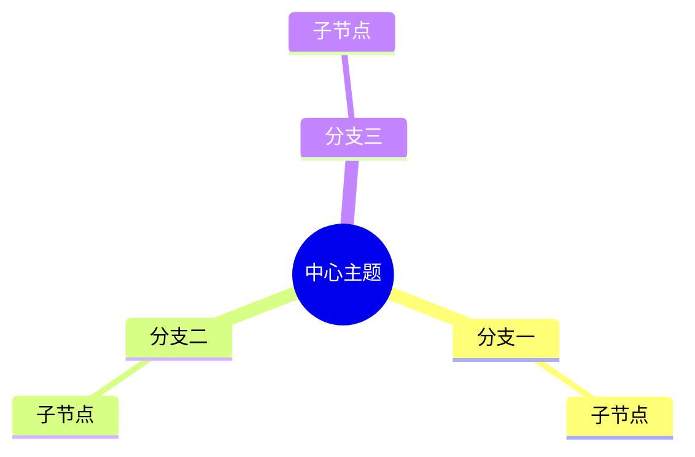

## 问题一：Mermaid 图表无法渲染

**问题**：文章中的 ````mermaid` 代码块只显示为代码，没有渲染成图表。

**解决方法**：在文章布局文件 `src/layouts/BlogPost.astro` 中添加 Mermaid 客户端渲染脚本：

```html
<script is:inline type="module">
	(async () => {
		const blocks = document.querySelectorAll('pre[data-language="mermaid"]');
		if (blocks.length === 0) return;

		const { default: mermaid } = await import('https://cdn.jsdelivr.net/npm/mermaid@11/dist/mermaid.esm.min.mjs');

		mermaid.initialize({
			startOnLoad: false,
			theme: 'default',
			securityLevel: 'loose',
			fontFamily: 'inherit',
		});

		for (const pre of blocks) {
			const graphDef = pre.textContent.trim();
			const id = 'mermaid-' + Math.random().toString(36).substring(2, 9);

			try {
				const { svg } = await mermaid.render(id, graphDef);
				const wrapper = document.createElement('div');
				wrapper.className = 'mermaid';
				wrapper.innerHTML = svg;
				pre.replaceWith(wrapper);
			} catch (err) {
				console.warn('Mermaid render error:', err);
			}
		}
	})();
</script>
```

注意选择器使用 `pre[data-language="mermaid"]`，因为 Astro 的 Shiki 高亮会将 mermaid 代码渲染为 `pre` 标签上的 `data-language` 属性。

---

## 问题二：GitHub Pages 内置 Jekyll 构建失败，收到报错邮件

**问题**：每次 `git push` 后收到邮件提示 "GitHub Pages 构建失败"，报错 `Invalid YAML front matter in ... BlogPost.astro`。

**原因**：GitHub Pages 默认使用 Jekyll 引擎构建，会尝试解析 `.astro` 文件导致失败。

**解决方法**：

**1. 将 Pages 构建类型改为 workflow**

```bash
gh api repos/<username>/<repo>/pages -X PUT -f build_type='workflow'
```

或在 GitHub 网页端：Settings → Pages → Source 选 GitHub Actions。

**2. 在仓库根目录添加 `.nojekyll` 空文件**

```bash
touch .nojekyll
```

**3. 在 `.github/workflows/deploy.yml` 的构建步骤中添加 `.nojekyll` 到 `dist/` 目录**

```yaml
      - name: Add .nojekyll
        run: touch dist/.nojekyll
```

---

## 问题三：Mermaid 图表渲染失败 — `Could not find a suitable point for the given distance`

**问题**：文章中的 `flowchart` 或 `graph` 图表在部署后显示 "Mermaid 渲染失败"，报错 `Could not find a suitable point for the given distance`。

**原因**：Mermaid v11 的布局引擎（dagre）在处理**多节点汇聚到同一目标**时，会因无法计算出合理的空间位置而报错。例如 6 个节点同时指向 1 个节点，或存在双层汇聚结构时。

**解决方法**：根据图的结构选择合适的语法类型：

### 方案一：将 `flowchart` 改为 `graph`

`flowchart` 是 Mermaid v11 的新布局引擎，对复杂结构兼容性较差。改为 `graph` 使用更稳定的 dagre 旧引擎：

```diff
- flowchart TD
+ graph TD
```

### 方案二：避免使用 `&` 合并语法

`&` 语法（如 `A & B & C --> D`）在多源汇聚时容易触发布局失败。改为逐条连线：

```diff
- A & B & C --> D["汇聚节点"]
+ A --> D["汇聚节点"]
+ B --> D["汇聚节点"]
+ C --> D["汇聚节点"]
```

### 方案三：多分支结构改用 `mindmap`

对于从中心向外辐射的树状/分支结构，`mindmap` 天然支持多分支展开，不需要布局引擎做复杂的路径计算：



### 方案四：避免节点文本中的特殊字符

节点文本中包含 `<div>`、`<script>` 等 HTML 标签或 `→` 箭头符号时，会导致 Mermaid 解析失败。改为纯文本描述：

```diff
- C["<div>用户输入</div>"]
+ C["div 标签内容"]

- B2["id=1001 → id=1002"]
+ B2["id=1001 改为 id=1002"]
```

### 方案五：复杂结构拆分为多张图

如果一张图包含 10+ 个节点且存在多层汇聚，建议拆为 2-3 张简单图，或用表格/列表替代。

---

## 修复总结

在 `BlogPost.astro` 布局文件中，最终的 Mermaid 渲染脚本做了以下改进：

1. **从 `span.line` 提取文本**：Shiki 高亮会把 mermaid 代码拆分为多个 `span.line`，直接从这些元素逐行提取文本，避免 `textContent` 带来的换行问题
2. **错误提示**：渲染失败时显示具体的错误信息，方便排查问题
3. **统一使用 `graph` 语法**：所有流程图统一使用 `graph TD` 或 `graph LR`，避免 `flowchart` 新引擎的不兼容
4. **特殊字符清理**：节点文本中不包含 HTML 标签和箭头符号
