## 一张图先看懂

Redis 不是传统意义上的"只提供 KV 的数据库"，它更像一个"**数据结构服务器**"：你给它不同的访问模式，它就用不同的底层编码去承载。

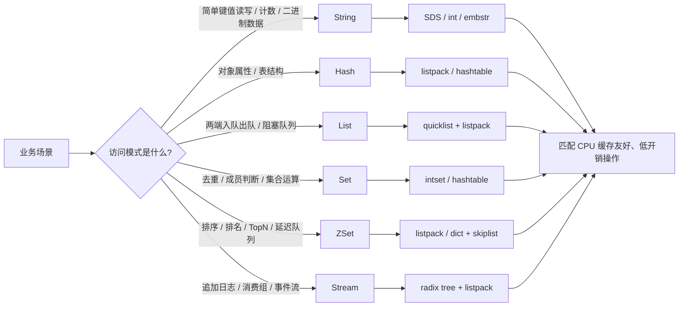

核心推导逻辑其实很简单：

1. 先看业务要什么操作。
2. 再看这个操作是不是"顺序访问、随机访问、排序访问、去重访问、追加访问"之一。
3. 最后让 Redis 的底层编码去贴合这个访问模式。

这就是 Redis 能把很多"看起来像数据库的问题"做得很快的原因。

---

## 先讲结论：Redis 常用数据结构怎么选

| 数据结构 | 主要用途 | 最典型的访问模式 | 底层实现要点 |
|---|---|---|---|
| String | 缓存、计数器、分布式锁、位图、序列化对象 | `GET/SET/INCR/APPEND/GETBIT` | SDS，短字符串/整数有不同编码 |
| Hash | 对象属性、用户信息、商品信息、配置表 | `HSET/HGET/HMGET/HDEL` | 小对象常用 `listpack`，大对象转 `hashtable` |
| List | 队列、消息列表、最新消息、阻塞队列 | `LPUSH/RPUSH/LPOP/RPOP/BLPOP` | `quicklist = 双向链表 + listpack` |
| Set | 去重、标签、关系集合、交并差 | `SADD/SISMEMBER/SINTER/SUNION` | `intset` 或 `hashtable` |
| ZSet | 排行榜、TopN、按时间排序、延迟任务 | `ZADD/ZRANGE/ZRANK/ZCOUNT` | `dict + skiplist`，小集合可用 `listpack` |
| Stream | 消息队列、事件流、消费组、审计日志 | `XADD/XREADGROUP/XACK/XTRIM` | `radix tree + listpack` |

如果你只记一件事，记这个：

**Redis 的数据结构选择，不是按"名字像不像"，而是按"访问模式合不合理"。**

---

## Redis 为什么能"把结构做对"

Redis 的核心不是单纯存字符串，而是把每个 key 都包装成一个 Redis 对象。这个对象有两个关键维度：

- `type`：这是什么类型，String / Hash / List / Set / ZSet / Stream。
- `encoding`：这个类型在当前数据规模下，用什么底层编码最省内存、最适合访问。

也就是说，同样是 Hash：

- 字段很少、值很短时，Redis 会优先用更紧凑的编码。
- 字段很多、需要频繁扩展时，会切换到更适合大规模查找的结构。

这就是 Redis 的一个重要设计思想：

**上层类型保持稳定，下层编码按场景动态选择。**

---

## 1. String

### 1.1 String 是什么

Redis 的 String 不只是"字符串"，它是最通用的值容器。它可以存：

- 文本
- 数字
- 二进制数据
- 序列化后的 JSON / Proto / 压缩块

所以 String 是 Redis 里最基础、也最灵活的数据类型。

### 1.2 主要用途

String 最常见的场景有四类：

1. 缓存整块对象
   - 比如把一个页面、一个 JSON、一个配置片段直接缓存进去。
2. 计数器
   - `INCR/DECR` 做访问量、点赞数、库存扣减等。
3. 分布式锁
   - `SET key value NX EX` 这类模式。
4. 位图 / 二进制标记
   - 例如签到、在线状态、用户是否激活。

### 1.3 底层是什么

String 的核心底层是 **SDS（Simple Dynamic String）**。

SDS 不是 C 语言那种以 `\0` 结尾的普通字符串，而是"**带长度信息的动态字符串**"。它的关键优势是：

- 可以直接拿到长度，不需要每次 `strlen` 扫描。
- 支持二进制安全，里面可以放 `\0`。
- 追加时更高效，减少频繁重新分配。

常见实现里，Redis 还会根据内容选择不同编码：

- 整数值可能直接用整数编码存。
- 短字符串会走更紧凑的表示。
- 长字符串则用更通用的动态字符串表示。

### 1.4 为什么它能支撑这些场景

#### 场景 A：缓存

缓存要求的是：

- 读写简单
- 值整体替换快
- 不关心内部字段结构

String 正好就是"一个 key 对应一个 blob"。

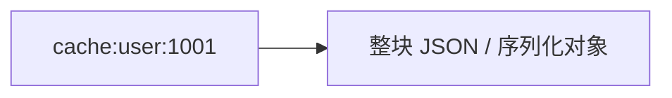

它不需要 Redis 理解对象内部字段，只要把整块值拿进来、拿出去就行，所以性能和模型都非常直接。

#### 场景 B：计数器

`INCR` 之所以快，是因为 Redis 不需要先把字符串转成复杂对象再处理，它可以直接在内部做数值增减。

所以 String 很适合：

- PV/UV 计数
- 点赞数
- 余额临时扣减
- 限流窗口计数

#### 场景 C：位图

位图本质上也是 String，只是把一个字符串当成 bit 数组来用。

比如：

- 第 1 位代表今天是否签到
- 第 10086 位代表某用户是否激活

因为底层是连续内存，所以按位读写很自然，空间也极省。

### 1.5 一句话总结

**String 是 Redis 的基础胶水层，适合"整块存储、原子计数、二进制标记"这类场景。**

---

## 2. List

### 2.1 List 是什么

List 是有序列表，元素有前后顺序，可以从两端插入和弹出。

它最典型的特征是：

- 有顺序
- 两端操作快
- 适合做队列和消息流转

### 2.2 主要用途

1. 消息队列
   - `LPUSH` 生产，`RPOP` 消费，或者反过来。
2. 最新消息列表
   - 例如最近 100 条通知、最近评论。
3. 阻塞队列
   - `BLPOP/BRPOP`。
4. 简单任务排队
   - 轻量级场景下可直接做 FIFO / LIFO。

### 2.3 底层是什么

Redis 现在常见的 List 底层是 **quicklist**。

quicklist 可以理解为：

> **双向链表 + 每个节点内部再存一段紧凑的 listpack**

这样设计的好处是：

- 双端增删方便。
- 每个节点内部数据连续，减少单个元素的指针开销。
- 比"纯链表"更省内存，比"纯数组"更适合两端操作。

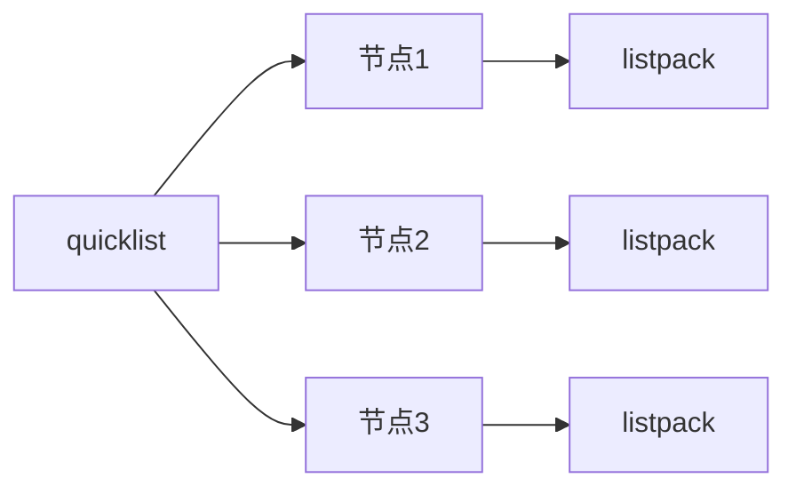

### 2.4 为什么它能支撑这些场景

#### 场景 A：队列

队列最看重的是：

- 先进先出
- 入队、出队快
- 支持阻塞等待

List 天生有顺序，且两端操作很友好，所以非常适合做队列。

比如：

- 生产者 `LPUSH`
- 消费者 `BRPOP`

这就是一个简单可靠的异步队列模型。

#### 场景 B：消息列表

消息流里，通常需要保留"最近 N 条"。

List 可以从头部或尾部不断插入，再裁剪一部分，这比每次去数据库分页查询更直接。

### 2.5 一句话总结

**List 适合"按顺序流动、两端高频增删、需要阻塞等待"的场景。**

---

## 3. Hash

### 3.1 Hash 是什么

Hash 可以理解为"Redis 里的小型字典"。

它把一个 key 下的多个 field-value 对组织起来，例如：

- `user:1001 -> name, age, gender, city`
- `product:2001 -> title, price, stock`

### 3.2 主要用途

1. 对象存储
   - 用户信息、商品信息、订单摘要。
2. 配置项
   - 一组相关配置放到一个 Hash 里。
3. 部分字段更新
   - 只改一个 field，不用重写整块对象。
4. 适合"表"的抽象
   - 非关系型但结构清晰。

### 3.3 底层是什么

Hash 常见有两类底层编码：

- **listpack**
  - 适合小 Hash，紧凑存储，减少内存碎片和指针开销。
- **hashtable**
  - 适合更大的 Hash，便于快速查找和扩展。

直观理解：

- 小 Hash 更像"压缩后的字段数组"。
- 大 Hash 更像"真正的哈希表"。

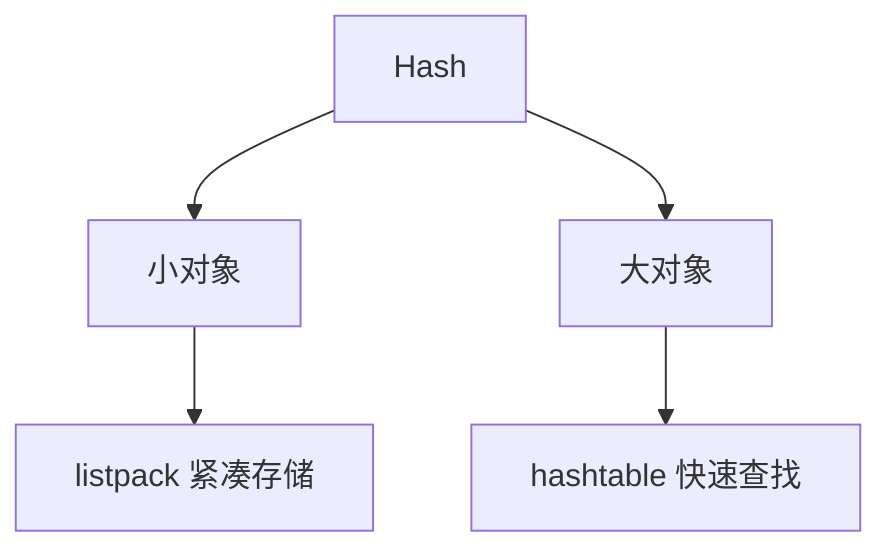

### 3.4 为什么它能支撑这些场景

#### 场景 A：用户对象

如果你把用户信息拆成多个字段：

- `name`
- `age`
- `avatar`
- `status`

那 Hash 比 String 更合适，因为：

- 修改某个字段不需要重写整个对象。
- 读一个对象时可以按 field 精确取值。
- 内存上比"很多独立 key"更省。

#### 场景 B：局部更新

比如库存系统里只想更新 `stock` 字段，Hash 可以把更新范围压缩到单个 field，避免整对象反序列化和回写。

### 3.5 一句话总结

**Hash 适合"对象化、字段化、局部更新"的数据。**

---

## 4. Set

### 4.1 Set 是什么

Set 是无序不重复集合。

它最核心的特性就两个：

- 元素唯一
- 支持集合运算

### 4.2 主要用途

1. 去重
   - 访问 IP、用户 ID、订单号等。
2. 标签
   - 某个内容有哪些标签。
3. 关系集合
   - 某个用户关注了哪些人。
4. 交并差
   - 推荐、共同好友、兴趣交集。

### 4.3 底层是什么

Set 常见有两种编码：

- **intset**
  - 当成员都是整数且数量较少时，使用紧凑整数集合。
- **hashtable**
  - 更一般的情况使用哈希表。

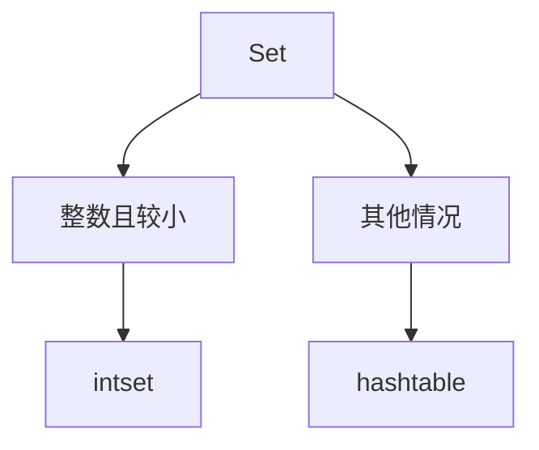

### 4.4 为什么它能支撑这些场景

#### 场景 A：去重

Set 的本质就是"天然不允许重复"。

如果某个用户 ID 已经存在，再 `SADD` 一次不会改变集合，这非常适合：

- UV 统计
- 访问去重
- 幂等标记

#### 场景 B：关系运算

Redis 提供 `SINTER`、`SUNION`、`SDIFF`，这使得它特别适合"集合视角"的业务。

例如：

- 共同好友 = 交集
- 推荐相似用户 = 交集 / 差集
- 已读/未读人群 = 差集

### 4.5 一句话总结

**Set 适合"天然去重 + 高效成员判断 + 集合运算"的场景。**

---

## 5. ZSet

### 5.1 ZSet 是什么

ZSet 叫有序集合。

它和 Set 最大的区别是：

- Set 只关心"有没有"
- ZSet 同时关心"有没有"以及"分数是多少"

每个 member 都有一个 score，Redis 会按 score 排序。

### 5.2 主要用途

1. 排行榜
   - 游戏积分、热度榜、销量榜。
2. TopN
   - 取前 100 名、前 10 条热帖。
3. 延迟任务
   - 用时间戳做 score。
4. 时间窗口统计
   - 用时间作为 score，按范围取数据。
5. 限流 / 滑动窗口
   - 通过 score 控制时间范围。

### 5.3 底层是什么

ZSet 的核心是 **dict + skiplist** 组合。

它的设计目的非常明确：

- `dict` 负责从 member 快速找到 score。
- `skiplist` 负责按 score 有序遍历、范围查询、排名查询。

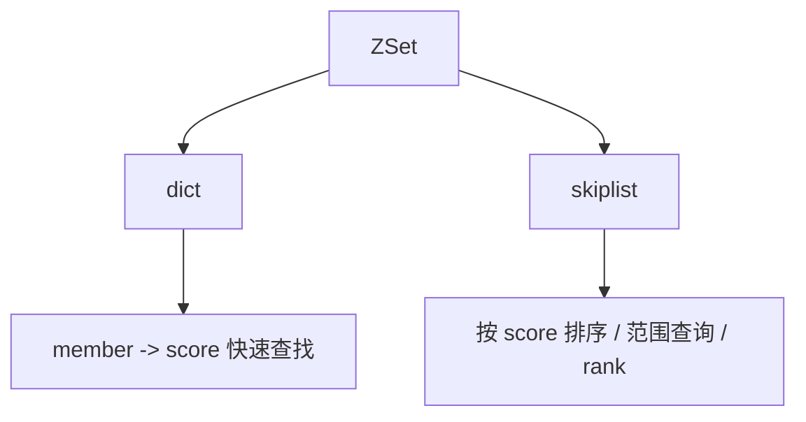

小对象时，Redis 也会使用更紧凑的编码方式，以降低内存成本。

### 5.4 为什么它能支撑这些场景

#### 场景 A：排行榜

排行榜最关键的是：

- 要能快速更新分数
- 要能快速拿前 N 名
- 要能快速查某个成员的名次

这正好分别对应：

- `ZADD` 更新 score
- `ZREVRANGE` / `ZRANGE` 取 TopN
- `ZRANK` / `ZREVRANK` 查排名

ZSet 的底层组合让这三件事都能高效完成。

#### 场景 B：延迟队列

如果把执行时间戳当成 score，那么：

- score 最小的元素最先到期
- 只要不断取 score <= 当前时间的元素即可

所以 ZSet 很适合做：

- 延迟消息
- 预约任务
- 定时清理

#### 场景 C：时间窗口

例如过去 10 分钟的点击记录。

把时间作为 score 后，只要按分数区间范围查询，就能快速拿到时间窗口内的元素。

### 5.5 一句话总结

**ZSet 适合"既要去重、又要排序、还要支持范围查询"的场景。**

---

## 6. Stream

### 6.1 Stream 是什么

Stream 是 Redis 专门为"消息流"和"事件流"设计的数据结构。

它不是简单的 List 替代品，而是更接近：

- 日志流
- 消息总线
- 消费组队列
- 事件源

### 6.2 主要用途

1. 消息队列
   - 多消费者读取同一条流。
2. 消费组
   - 不同消费者各处理自己的消息。
3. 事件日志
   - 保留历史事件，支持回放。
4. 审计 / 追踪
   - 记录动作序列。

### 6.3 底层是什么

Stream 的底层常见是：

- **radix tree**
  - 用于按 ID 快速组织和定位。
- **listpack**
  - 用于紧凑存储每个 macro node 里的多条消息。

这套结构的目标是：

- 既能顺序追加
- 又能按 ID 范围读取
- 还能高效裁剪旧数据
- 还支持 consumer group 的状态管理

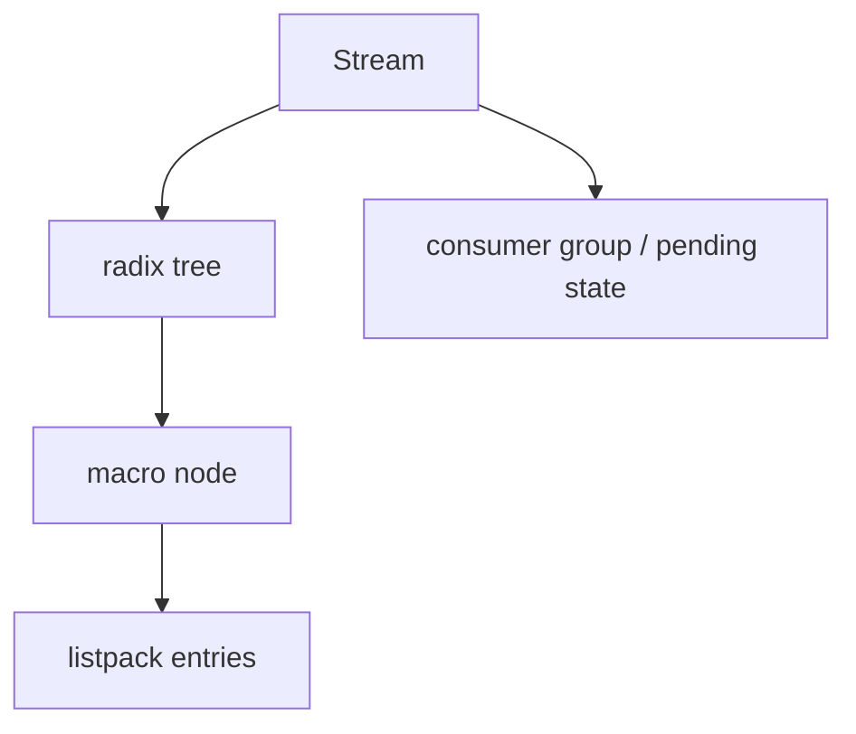

### 6.4 为什么它能支撑这些场景

#### 场景 A：消息队列

Stream 天生适合做"生产 -> 消费"链路，因为它有：

- 追加写入
- 顺序读取
- 消费确认
- 未确认消息追踪

这比 List 做队列更强，因为 Stream 还解决了：

- 谁消费了
- 谁没消费
- 消费失败怎么办

#### 场景 B：事件回放

事件日志的要求不是"只保留最后一个值"，而是：

- 要保留历史
- 要能从某个 ID 开始重新读

Stream 通过 ID 顺序天然适合回放，这一点是普通 Hash 或 String 不具备的。

#### 场景 C：消费组

消费组是 Stream 很重要的能力。

它允许多个消费者在同一个流上协作，每个消息只被组内某个消费者处理，适合：

- 异步任务分发
- 多 worker 处理
- 失败重试和 pending 管理

### 6.5 一句话总结

**Stream 适合"追加式事件流 + 消费组 + 历史回放"的消息场景。**

---

## 7. 常见补充类型

如果面试官继续追问，下面这些也经常会被问到。

### 7.1 Bitmap

Bitmap 本质上还是 String，只是把它当位数组来用。

典型场景：

- 签到
- 是否读过
- 在线状态
- 用户行为标记

它的价值是：

- 极省空间
- 位操作快
- 适合海量布尔标记

### 7.2 HyperLogLog

HyperLogLog 也是 Redis 里非常经典的"近似计算"结构。

它适合：

- UV 去重估算
- 海量去重计数

它的思路不是"精确存所有元素"，而是用概率和统计方法估算基数，所以内存非常省。

### 7.3 Geo

Geo 本质上是基于有序集合来实现地理位置能力。

适合：

- 附近的人
- 附近的店
- 地理距离排序

因为它本质上还是"带排序能力的集合"，所以和 ZSet 的思路很接近。

---

## 7.4 Bitmap

### Bitmap 是什么

Bitmap 不是独立的新内核类型，它本质上还是 String，只是把 String 当成一个位数组来用。

也就是说：

- 一个 bit 表示一个状态
- 0 / 1 代表否 / 是
- 通过位偏移来读写

### 主要用途

1. 签到
   - 用一个 bit 表示某天是否签到。
2. 用户状态标记
   - 是否激活、是否会员、是否已读。
3. 海量布尔值存储
   - 比如对千万用户做行为标记。
4. 快速统计
   - 统计某段时间内多少人完成了某动作。

### 底层是什么

Bitmap 依赖 String 的连续内存表示。

它不是为"存很多对象"设计的，而是为"存很多位"设计的，所以底层非常紧凑。

### 为什么它能支撑这些场景

Bitmap 最适合的场景特征是：

- 状态只有两种
- 数据量很大
- 对空间敏感
- 需要快速按位访问

比如签到系统：

- 第 1 天签到就把第 1 位设为 1
- 第 2 天签到就把第 2 位设为 1

这样一个月的签到记录只要几十个 bit 就够了，空间成本极低。

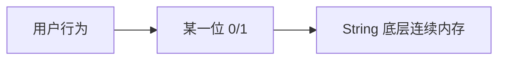

### 常用 Redis 命令

```redis
SETBIT key offset value
GETBIT key offset
BITCOUNT key
BITPOS key bit
BITOP AND destkey key1 key2
BITOP OR destkey key1 key2
BITOP XOR destkey key1 key2
BITOP NOT destkey key1
```

### Java 示例

```java
StringRedisTemplate stringRedisTemplate = ...

// 某用户第 100 天是否签到
stringRedisTemplate.opsForValue().setBit("sign:2026:04", 100, true);
Boolean signed = stringRedisTemplate.opsForValue().getBit("sign:2026:04", 100);

// 统计签到了多少天
Long count = stringRedisTemplate.opsForValue().bitCount("sign:2026:04");
```

### 一句话总结

**Bitmap 适合"海量布尔状态 + 极致省空间 + 位级操作"的场景。**

---

## 7.5 Geo

### Geo 是什么

Geo 不是独立的底层结构名，它本质上是基于 ZSet 做地理位置编码和距离计算的一层能力。

可以理解为：

- 把经纬度转换成可排序的编码值
- 存到 ZSet 里
- 再通过范围和距离相关命令做查询

### 主要用途

1. 附近的人
2. 附近的店
3. 周边配送范围
4. 地理距离排序

### 底层是什么

Geo 的核心仍然依赖 ZSet 的有序能力，只是 Redis 帮你把"经纬度 -> 排序编码"这一步封装掉了。

所以从实现思路上看：

- 数据还是放在有序集合里
- 查询时按距离或半径做过滤
- 返回的是符合范围的成员

### 为什么它能支撑这些场景

地理位置场景最核心的诉求是：

- 快速找附近的点
- 按距离排序
- 支持半径查询

这些能力如果自己手写，通常要做：

- 经纬度转编码
- 范围筛选
- 排序
- 距离计算

Redis 把这套能力抽象到了 Geo 命令层，底层继续利用 ZSet 的排序和范围查询能力，所以能做得又快又简单。

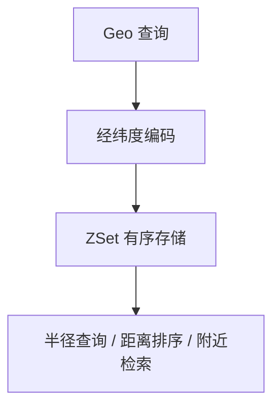

### 常用 Redis 命令

```redis
GEOADD key longitude latitude member
GEODIST key member1 member2 [m|km|ft|mi]
GEOPOS key member
GEORADIUS key longitude latitude radius m|km|ft|mi
GEOSEARCH key FROMLONLAT longitude latitude BYRADIUS radius m|km
GEOSEARCH key FROMLONLAT longitude latitude BYBOX width height m|km
GEOHASH key member
```

### Java 示例

```java
RedisTemplate<String, Object> redisTemplate = ...

// 写入地理位置
redisTemplate.opsForGeo().add("geo:shop", new Point(116.397128, 39.916527), "beijing-shop");

// 查询距离
Distance distance = redisTemplate.opsForGeo()
    .distance("geo:shop", "beijing-shop", "other-shop", Metrics.KILOMETERS);

// 查询附近
RedisGeoCommands.GeoRadiusCommandArgs args = RedisGeoCommands.GeoRadiusCommandArgs
    .newGeoRadiusArgs()
    .includeDistance()
    .sortAscending()
    .limit(10);
GeoResults<RedisGeoCommands.GeoLocation<Object>> results =
    redisTemplate.opsForGeo().radius("geo:shop", new Circle(new Point(116.397128, 39.916527), new Distance(5, Metrics.KILOMETERS)), args);
```

### 一句话总结

**Geo 适合"附近搜索 + 距离排序 + 半径范围查询"的位置类场景，本质上是 ZSet 能力的地理化封装。**

---

## 7.6 HyperLogLog

### HyperLogLog 是什么

HyperLogLog 是用来做"**基数估算**"的结构，也就是估算"有多少个不同元素"。

它的特点不是精确，而是：

- 结果近似
- 内存极省
- 适合超大规模去重统计

### 主要用途

1. UV 统计
2. 独立访客数估算
3. 海量去重计数
4. 大规模流量分析

### 底层是什么

HyperLogLog 的核心不是把每个元素都存下来，而是保存一组概率统计特征，用这些特征去推算基数。

所以它的设计目标非常明确：

- 用很小的内存换取近似计数
- 不追求 100% 精确
- 追求"足够准 + 很省资源"

### 为什么它能支撑这些场景

比如 UV 场景：

- 你关心的是"今天有多少独立访问者"
- 不是"今天每个访问者是谁"

如果用 Set 存所有用户 ID，数据量一大，内存会不断上涨。
如果用 HyperLogLog，只保留统计特征，就能在很小的空间里完成估算。

这类场景的业务特征非常明确：

- 数据量巨大
- 可接受微小误差
- 更在意成本而不是绝对精确

所以 HyperLogLog 特别适合做报表类、监控类、趋势类统计。

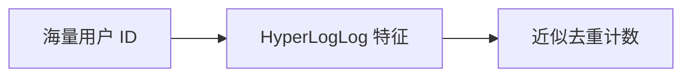

### 常用 Redis 命令

```redis
PFADD key element1 element2
PFCOUNT key
PFMERGE destkey sourcekey1 sourcekey2
```

### Java 示例

```java
StringRedisTemplate stringRedisTemplate = ...

// 记录 UV
stringRedisTemplate.opsForHyperLogLog().add("uv:2026-04-24", "u1001", "u1002", "u1003");

// 估算去重数量
Long uv = stringRedisTemplate.opsForHyperLogLog().size("uv:2026-04-24");

// 合并多个统计结果
stringRedisTemplate.opsForHyperLogLog().union("uv:month:2026-04", "uv:2026-04-01", "uv:2026-04-02");
```

### 一句话总结

**HyperLogLog 适合"海量去重估算 + 可接受微小误差 + 极致省内存"的统计类场景。**

---

## 总结：Redis 数据结构选型思维导图

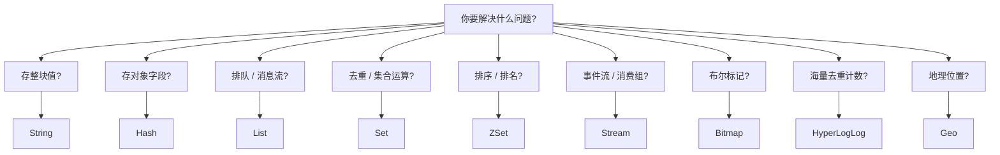
