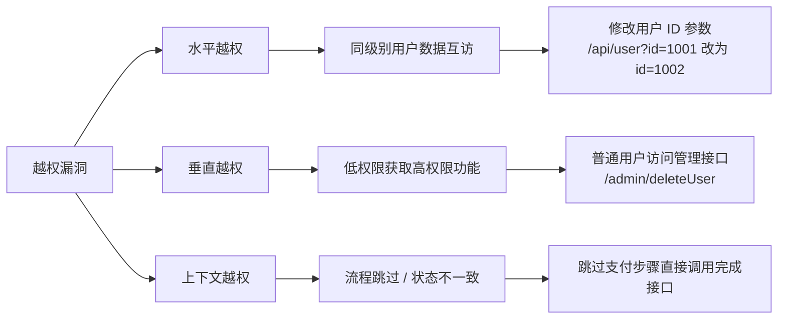
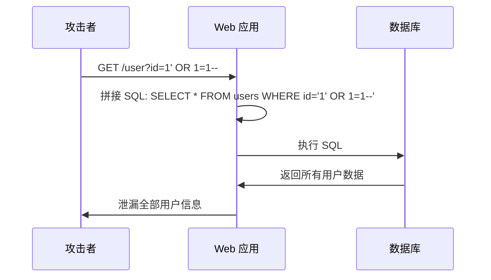
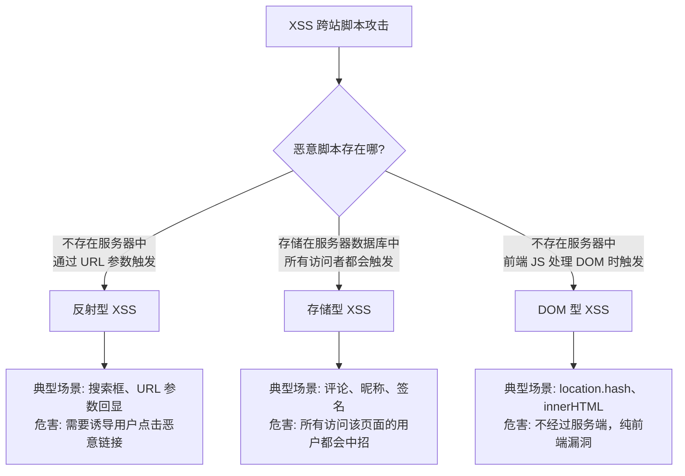
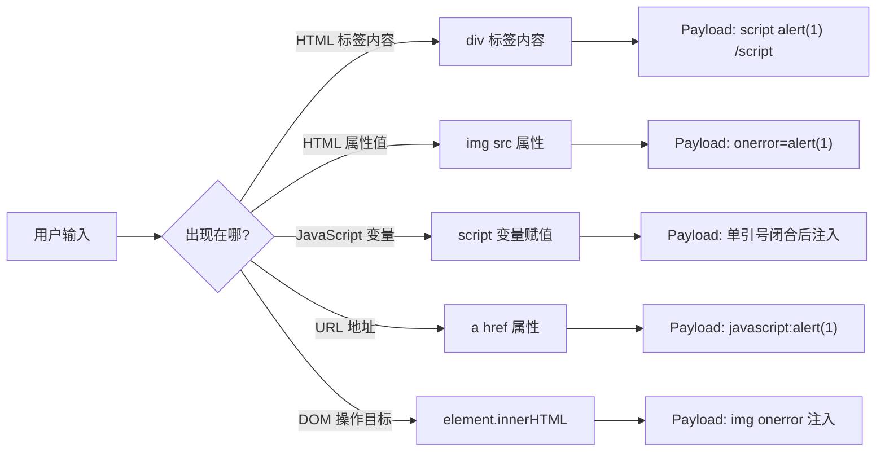
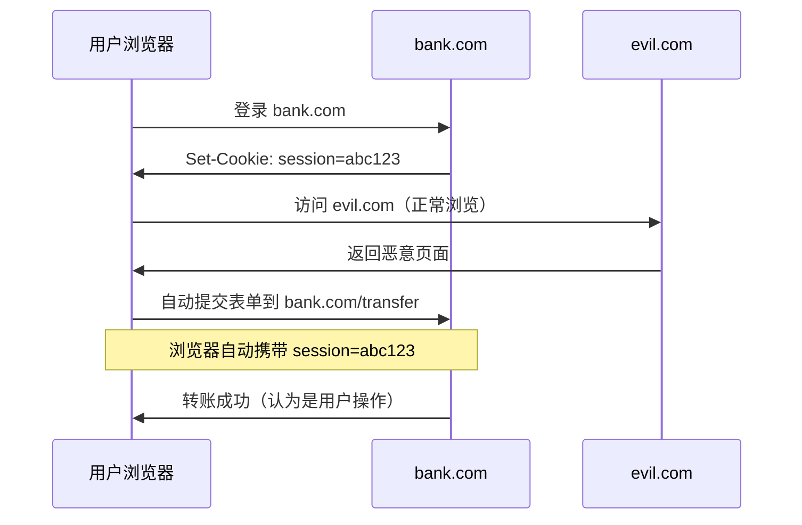
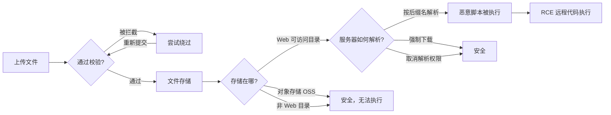
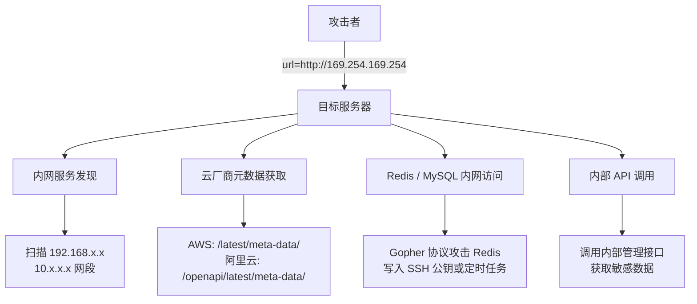
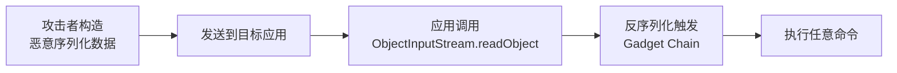
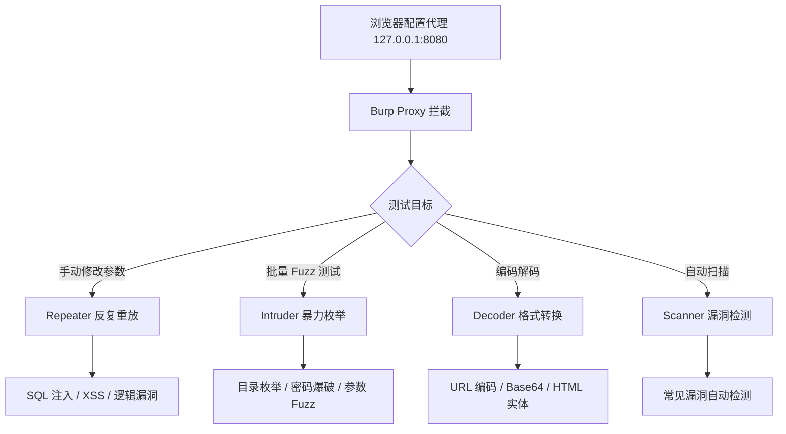
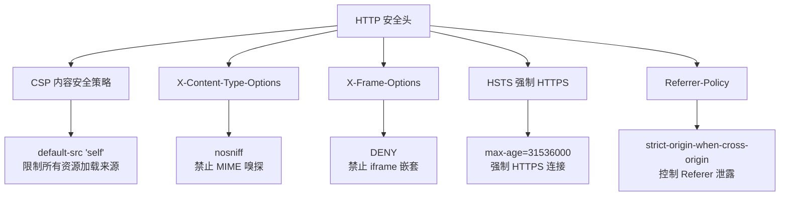

## 先画一张全景图

Web 安全的核心矛盾只有一句话：

**服务端永远不能信任客户端提交的数据。**

所有漏洞都围绕这个矛盾展开——攻击者想办法让服务端把恶意数据当作代码执行，防御者想办法把数据和代码彻底隔离。


这张图不需要背，只需要理解一件事：

**漏洞不是"工具扫出来的"，而是"逻辑推导出来的"。** 知道数据从哪来、到哪去、中间经过了什么处理，漏洞自然就浮现了。

---

## OWASP Top 10 深度拆解

### 1. Broken Access Control（失效的访问控制）

这是近年占比最高的漏洞类型。原因很简单：业务越做越复杂，权限模型越来越难维护。

#### 攻击面分析



#### 关键测试思路

水平越权的测试方法非常直接：准备两个账号 A 和 B，用 A 的 token 去请求 B 的资源。如果服务端返回了 B 的数据，越权成立。

具体操作时重点盯这几个地方：

- **自增 ID 型接口**：`/api/order/1001`、`/api/user/500` 这类接口，改个数字就能访问别人数据
- **非直接 ID 但可枚举**：用户名、邮箱等可猜测的标识符
- **批量操作接口**：`/api/batchDelete?ids=1,2,3`，往里面加一个不属于自己的 ID
- **导出功能**：`/api/export?userId=me` 改成别人的 userId
- **API 版本遗漏**：v2 接口加了权限校验，v1 接口忘了加

#### 防御方案

权限校验必须落在服务端，而且要在**数据查询之前**就拦截。典型的错误写法是先查出数据，再判断权限，这种即使校验失败数据也已经从数据库里捞出来了。

```java
// 错误示范：先查数据再校验权限
Order order = orderMapper.selectById(orderId);
if (!order.getUserId().equals(currentUserId)) {
    throw new SecurityException("无权访问");
}
// 问题：数据已经查出来了

// 正确做法：查询条件里就带上用户 ID
Order order = orderMapper.selectByIdAndUserId(orderId, currentUserId);
if (order == null) {
    throw new SecurityException("订单不存在");
}
// 数据不会越界
```

更系统的做法是引入统一的权限拦截层，所有敏感接口走同一个校验管道：

```java
@PreAuthorize("hasRole('ADMIN') or #userId == authentication.principal.id")
public User getUserDetail(@PathVariable Long userId) {
    return userService.getById(userId);
}
```

---

### 2. Injection（注入攻击）

#### SQL 注入：从原理到防御

SQL 注入的本质是**数据变成了代码**。用户输入的内容被数据库当作 SQL 语法执行。



**注入技术的分类不是背出来的，是根据"你能看到什么"推导的：**

| 你能看到什么 | 可用的注入方式 | 原理 |
|---|---|---|
| 页面直接回显查询结果 | 联合查询注入 | 用 `UNION` 拼接额外查询 |
| 页面只显示"成功/失败" | 布尔盲注 | 逐位猜解，根据真假状态判断 |
| 页面什么都不显示 | 时间盲注 | 用 `SLEEP()` 通过响应时间判断 |
| 页面返回数据库错误信息 | 报错注入 | 利用 `ExtractValue` 等函数回显数据 |

**常见 Payload 的逻辑拆解：**

```sql
-- 联合查询：在原有结果后面拼上自己的查询
' UNION SELECT username, password FROM users --

-- 布尔盲注：通过条件真假逐位猜解
' AND (SELECT SUBSTRING(password,1,1) FROM users WHERE id=1) = 'a' --

-- 时间盲注：用延迟判断注入是否生效
' AND IF(1=1, SLEEP(5), 0) --

-- 报错注入：利用 MySQL 的 XPath 报错回显数据
' AND ExtractValue(1, CONCAT(0x7e, (SELECT version()))) --
```

**MyBatis 中的 `#{}` 和 `${}` 是高频考点：**

```xml
<!-- 安全：预编译，用户输入始终作为数据处理 -->
<select id="getUser">
    SELECT * FROM users WHERE id = #{id}
</select>

<!-- 危险：字符串拼接，用户输入直接进入 SQL 语法 -->
<select id="getUser">
    SELECT * FROM users WHERE id = ${id}
</select>
```

`#{}` 生成的是 `PreparedStatement` 的占位符 `?`，数据库执行时先编译 SQL 结构，再传入参数。参数永远不会改变 SQL 的语法树。

`${}` 是直接把变量值拼接到 SQL 字符串里。如果 `id` 的值是 `1 OR 1=1`，SQL 就变成了 `SELECT * FROM users WHERE id = 1 OR 1=1`，语法被改变了。

#### 命令注入与 XXE

命令注入发生在应用调用系统命令且参数可控时：

```java
// 危险：用户输入直接进入系统命令
Runtime.getRuntime().exec("ping " + userInput);
// 输入: 127.0.0.1; cat /etc/passwd
// 实际执行: ping 127.0.0.1; cat /etc/passwd
```

XXE 则是 XML 解析器处理外部实体时的问题：

```xml
<!-- 攻击者提交的 XML -->
<?xml version="1.0" encoding="UTF-8"?>
<!DOCTYPE foo [
    <!ENTITY xxe SYSTEM "file:///etc/passwd">
]>
<data>&xxe;</data>
```

防御 XXE 最彻底的方式是禁用 DTD：

```java
DocumentBuilderFactory factory = DocumentBuilderFactory.newInstance();
factory.setFeature("http://apache.org/xml/features/disallow-doctype-decl", true);
```

---

### 3. XSS（跨站脚本攻击）

#### 三种类型的本质区别



**存储型 XSS 危害最大的原因**：它不需要诱导用户点击特定链接。只要用户访问了包含恶意数据的页面，脚本就会执行。如果攻击者在评论里存了一段脚本，所有看到这个评论的人都会被影响。

#### XSS 的上下文决定 Payload 构造

很多文章只给 Payload 列表，但不说为什么用这个。关键在于**你的输入出现在 HTML 的哪个位置**：



理解了上下文，Payload 不是背出来的，是推导出来的。

#### 输出编码的核心逻辑

防御 XSS 的关键不是"过滤掉 script 标签"，而是**根据输出位置做正确的编码**：

| 输出位置 | 编码方式 | 编码后效果 |
|---|---|---|
| HTML 标签内容 | HTML 实体编码 | `<` → `&lt;`，`>` → `&gt;` |
| HTML 属性值 | HTML 实体编码 + 引号转义 | `"` → `&quot;` |
| JavaScript 变量 | JS Unicode 编码 | `<` → `\u003c` |
| URL 参数 | URL 编码 | `<` → `%3C` |
| CSS 值 | CSS 转义 | `<` → `\3C ` |

**Java 中的正确做法：**

```java
import org.owasp.encoder.Encode;

// HTML 内容上下文
out.write(Encode.forHtml(userInput));

// HTML 属性上下文
out.write(Encode.forHtmlAttribute(userInput));

// JavaScript 上下文
out.write(Encode.forJavaScript(userInput));

// URL 参数上下文
out.write(Encode.forUriComponent(userInput));
```

不要自己写正则过滤。正则过滤一定会被绕过。

---

### 4. CSRF（跨站请求伪造）

#### 攻击原理：浏览器的"好心"

CSRF 利用的是浏览器的一个基本行为：**同源请求会自动携带 Cookie**。



#### 为什么 SameSite Cookie 不能完全替代 Token

`SameSite=Lax` 确实能阻止跨站 POST 请求，但有例外：

- 用户通过链接跳转（`<a href>`）会携带 Cookie
- 部分旧浏览器不支持 SameSite
- 子域名请求不受限制

所以 CSRF Token 仍然是**最可靠的第一道防线**，SameSite 是**有价值的纵深防御层**。

#### Token 机制的实现要点

```java
// 生成 Token（每次渲染表单时）
String token = UUID.randomUUID().toString();
session.setAttribute("csrfToken", token);
request.setAttribute("csrfToken", token);

// JSP 中嵌入 Token
<input type="hidden" name="csrfToken" value="${csrfToken}">

// 服务端验证
String requestToken = request.getParameter("csrfToken");
String sessionToken = (String) session.getAttribute("csrfToken");

if (requestToken == null || !requestToken.equals(sessionToken)) {
    response.sendError(403, "CSRF Token 校验失败");
    return;
}
```

Token 设计的核心要求：

1. **随机且不可预测**：用 `SecureRandom` 或 `UUID`
2. **与 Session 绑定**：Token 存在 Session 中
3. **一次一换**：关键操作使用后立即失效
4. **放在请求体中而非 Header**：确保表单提交能携带

---

### 5. 文件上传漏洞

#### 漏洞链：从上传到执行

文件上传不是"传个文件"这么简单，它是一整条攻击链：



整个链条里，只要有一个环节阻断，攻击就失败。防御的思路就是在每个环节都加阻断。

#### 绕过技术拆解

| 校验层 | 防御方做法 | 攻击方绕过 | 原理 |
|---|---|---|---|
| 前端 JS | 检查文件后缀 | 禁用 JS / Burp 改包 | 前端校验不可信 |
| Content-Type | 检查 MIME 类型 | Burp 修改为 `image/jpeg` | MIME 由客户端指定 |
| 后缀名黑名单 | 拦截 `.php` | `.php5`、`.phtml`、`.phar` | 黑名单覆盖不全 |
| 大小写检测 | 拦截 `.PHP` | `.PhP`、`.pHp` | 大小写匹配不全 |
| 特殊字符过滤 | 替换危险字符 | 双写 `pphphp` → `php` | 单次替换后被还原 |
| 文件名截断 | 限制合法后缀 | `shell.php%00.jpg` | 老版本 C 字符串截断 |
| 文件内容检测 | 检查文件头 | 图片马：`GIF89a + PHP 代码` | 文件头合法但内容恶意 |
| `.htaccess` 过滤 | 拦截配置文件 | 上传 `.htaccess` 修改解析规则 | Apache 配置优先级高 |

**图片马的原理**：很多上传接口只检查文件头（魔数）判断文件类型。攻击者可以在合法图片文件后面追加脚本代码：

```
# 构造图片马
copy /b normal.jpg + shell.php shell.jpg

# 文件头仍然是 GIF89a，但文件后半部分是 PHP 代码
# 如果服务器将该文件当作 PHP 解析，代码就会执行
```

#### 防御方案：纵深防御

```java
// 第一层：白名单校验（不是黑名单）
private static final Set<String> ALLOWED_EXTENSIONS = Set.of("jpg", "jpeg", "png", "gif", "pdf");

String extension = FilenameUtils.getExtension(originalFilename).toLowerCase();
if (!ALLOWED_EXTENSIONS.contains(extension)) {
    throw new SecurityException("不支持的文件类型: " + extension);
}

// 第二层：内容校验（检查文件真实类型）
String mimeType = Files.probeContentType(tempFile.toPath());
if (!mimeType.startsWith("image/") && !mimeType.equals("application/pdf")) {
    throw new SecurityException("文件内容不匹配");
}

// 第三层：随机文件名（避免覆盖和预测）
String safeFilename = UUID.randomUUID().toString() + "." + extension;

// 第四层：文件大小限制
if (tempFile.length() > 10 * 1024 * 1024) { // 10MB
    throw new SecurityException("文件过大");
}

// 第五层：存储到非 Web 目录或使用 OSS
String uploadPath = "/data/uploads/" + safeFilename;
// 或使用阿里云 OSS / AWS S3 等对象存储
```

Nginx 层面的辅助防御：

```nginx
# 上传目录禁止脚本解析
location /uploads/ {
    # 取消 PHP 解析
    location ~ \.php$ {
        deny all;
        return 403;
    }
}
```

**核心原则：永远不要相信客户端传来的"文件名"和"文件类型"。**

---

### 6. SSRF（服务端请求伪造）

#### 攻击场景

SSRF 的威力不在"让服务器发请求"，而在"服务器能访问到你访问不到的地方"。



**云环境元数据接口是 SSRF 最常见的利用目标：**

| 云厂商 | 元数据地址 | 可获取信息 |
|---|---|---|
| AWS | `http://169.254.169.254/latest/meta-data/` | IAM 凭证、安全组、实例信息 |
| 阿里云 | `http://100.100.100.200/latest/meta-data/` | RAM 角色凭证、实例信息 |
| 腾讯云 | `http://metadata.tencentyun.com/latest/meta-data/` | 类似 AWS |

拿到 IAM 凭证后，攻击者可以直接操作云资源——这已经不是"读个文件"的程度了。

#### 防御方案

```java
// 第一层：协议白名单（只允许 HTTP/HTTPS）
URI uri = new URI(userInputUrl);
String scheme = uri.getScheme();
if (!"http".equals(scheme) && !"https".equals(scheme)) {
    throw new SecurityException("不支持的协议: " + scheme);
}

// 第二层：内网地址黑名单
String host = uri.getHost();
InetAddress address = InetAddress.getByName(host);

if (address.isSiteLocalAddress() || address.isLoopbackAddress()) {
    throw new SecurityException("禁止访问内网地址: " + host);
}

// 第三层：DNS 重绑定防护（请求前后都校验 IP）
// 防止攻击者控制的域名在解析时切换 IP
InetAddress resolvedIp = InetAddress.getByName(host);
// 发起请求后再次校验实际连接的 IP
```

DNS Rebinding 是一个容易被忽略的攻击技巧：攻击者控制一个域名，第一次 DNS 查询返回公网 IP（通过校验），发起请求时 DNS 更新为内网 IP（绕过校验）。防御方法是**在发起请求前和连接建立后都校验 IP**。

---

### 7. 安全配置错误

这不是"某个漏洞"，而是一类问题的集合。核心原因是**默认配置 ≠ 安全配置**。

常见的问题点：

| 问题 | 风险 | 修复 |
|---|---|---|
| 默认账号密码（admin/admin） | 直接接管系统 | 首次登录强制修改密码 |
| 错误页面泄露堆栈信息 | 暴露技术栈和代码路径 | 自定义错误页面 |
| 目录浏览开启 | 泄露文件结构 | 关闭目录列表 |
| 不必要的 HTTP 方法（PUT/DELETE） | 可能上传恶意文件 | 仅允许 GET/POST |
| CORS 配置 `Access-Control-Allow-Origin: *` | 跨站数据泄露 | 精确配置允许的域名 |
| 调试接口未关闭（`/actuator`、`/debug`） | 泄露运行时信息 | 生产环境禁用 |

**Spring Boot Actuator 是重灾区：**

```yaml
# 错误的生产配置
management:
  endpoints:
    web:
      exposure:
        include: "*"  # 暴露所有端点

# 正确的生产配置
management:
  endpoints:
    web:
      exposure:
        include: health,info  # 仅暴露必要端点
  endpoint:
    env:
      enabled: false  # 禁用环境变量端点
```

访问 `/actuator/env` 可以看到所有环境变量，**包括数据库密码和 API 密钥**。

---

### 8. 不安全的反序列化

#### Java 反序列化漏洞原理

Java 反序列化时，会从字节流中重建对象。如果这个类有 `readObject()` 方法，反序列化时会自动调用。攻击者可以构造包含恶意逻辑的序列化对象，在 `readObject()` 中执行任意代码。



#### Gadget Chain 是什么

Gadget Chain 是一串"看起来正常但在特定组合下能执行恶意代码"的方法调用链。攻击者不需要目标应用有"漏洞代码"，只需要目标应用的 classpath 里存在某些常见库（Apache Commons Collections、Spring 等）。

这也是为什么 Java 反序列化被称为"**一次反序列化，全网皆漏洞**"——一个库的 Gadget Chain 可以影响所有使用这个库的应用。

#### 防御方案

```java
// 最安全：完全禁止反序列化不可信数据
// 如果必须用：

// 方案一：使用白名单校验
ObjectInputStream ois = new ObjectInputStream(inputStream) {
    @Override
    protected Class<?> resolveClass(ObjectStreamClass desc)
            throws IOException, ClassNotFoundException {
        String name = desc.getName();
        if (!ALLOWED_CLASSES.contains(name)) {
            throw new InvalidClassException("反序列化被拒绝: " + name);
        }
        return super.resolveClass(desc);
    }
};

// 方案二：使用安全的序列化框架（避免 Java 原生序列化）
// 推荐：Jackson（JSON）、Protobuf、Kryo
ObjectMapper mapper = new ObjectMapper();
mapper.activateDefaultTyping(mapper.getPolymorphicTypeValidator(),
    ObjectMapper.DefaultTyping.NON_FINAL);
// 配合严格的类型白名单
```

---

## 安全测试工具链

### Burp Suite 核心工作流

Burp 不是"点一下自动扫描"的工具。它的核心价值是**让你看到和控制每一个 HTTP 请求**。



#### Intruder 攻击类型的选择逻辑

| 攻击类型 | Payload 数量 | 位置数量 | 组合方式 | 适用场景 |
|---|---|---|---|---|
| Sniper | 1 个集合 | 多个位置 | 每个位置逐个测试 | 单一参数 Fuzz |
| Battering ram | 1 个集合 | 多个位置 | 所有位置用同一 Payload | 多参数同值测试 |
| Pitch fork | N 个集合 | N 个位置 | 第 i 个集合对应第 i 个位置 | 已知关联参数 |
| Cluster bomb | N 个集合 | N 个位置 | 笛卡尔积全组合 | 多参数组合 Fuzz |

**Cluster bomb 最全面也最慢**：3 个位置各 100 个 Payload，会产生 100 × 100 × 100 = 1,000,000 次请求。使用时一定要先缩小范围。

#### 常见 Fuzz 字典构造思路

不要拿着一份通用字典到处跑。字典应该根据目标的技术栈和场景定制：

```
# 文件上传场景
shell.php, shell.php5, shell.phtml, shell.php.jpg
.htaccess, web.config, test.jsp, info.aspx

# SQL 注入场景
', ", 1' OR '1'='1, admin'--, 1' AND SLEEP(5)--

# 目录遍历场景
../../../etc/passwd, ..%2f..%2f..%2fetc%2fpasswd
....//....//....//etc/passwd

# XSS 场景
<script>alert(1)</script>, ">
<svg onload=alert(1)>, <body onload=alert(1)>
```

---

### 自动化脚本的设计思路

在安全测试中，信息收集和测试面梳理往往占了 60% 以上的时间。把重复工作自动化，可以把精力集中在真正需要手工分析的地方。

#### URL 爬取与去重

核心逻辑不复杂：从种子 URL 出发，提取页面中的所有链接，过滤同域名，去重后继续爬取。

```python
import requests
from urllib.parse import urljoin, urlparse
from bs4 import BeautifulSoup
from collections import deque

class URLCrawler:
    def __init__(self, base_url, max_depth=3):
        self.base_url = base_url
        self.domain = urlparse(base_url).netloc
        self.max_depth = max_depth
        self.visited = set()
        self.param_urls = set()  # 带参数的 URL（测试面）

    def crawl(self):
        queue = deque([(self.base_url, 0)])

        while queue:
            url, depth = queue.popleft()

            if url in self.visited or depth > self.max_depth:
                continue

            self.visited.add(url)

            if '?' in url:
                self.param_urls.add(url)

            try:
                resp = requests.get(url, timeout=10, allow_redirects=True)
                if 'text/html' in resp.headers.get('Content-Type', ''):
                    links = self._extract_links(resp.text, url)
                    for link in links:
                        if link not in self.visited:
                            queue.append((link, depth + 1))
            except Exception:
                pass

    def _extract_links(self, html, base_url):
        soup = BeautifulSoup(html, 'html.parser')
        links = set()

        for tag in soup.find_all(['a', 'form']):
            href = tag.get('href') or tag.get('action')
            if href:
                full_url = urljoin(base_url, href)
                if urlparse(full_url).netloc == self.domain:
                    links.add(full_url)

        return links

    def get_test_surface(self):
        """提取测试面：按参数名分组，识别注入点"""
        from collections import defaultdict
        params_map = defaultdict(set)

        for url in self.param_urls:
            parsed = urlparse(url)
            qs = parsed.query.split('&')
            for param in qs:
                if '=' in param:
                    name = param.split('=')[0]
                    params_map[name].add(url)

        return dict(params_map)
```

**关键设计点：**

1. **去重用 `set` 而不是 `list`**：查找时间复杂度 O(1)，避免重复爬取
2. **深度限制**：避免无限递归，3 层深度通常已经覆盖核心功能
3. **同域名过滤**：不爬外部链接，聚焦目标资产
4. **参数分组**：按参数名归类 URL，`?id=` 对应 SQL 注入测试面，`?name=` 对应 XSS 测试面

#### 关于 JS 渲染的补充

上面的爬虫只能处理服务端渲染的页面。如果目标应用是 SPA（Vue/React/Angular），链接都是通过 JS 动态生成的，纯 requests 就无能为力了。

处理方式有两种：

- **直接分析 JS 文件**：下载 `.js` 文件，用正则提取其中的 API 路径和路由
- **使用 Headless 浏览器**：Selenium 或 Playwright 模拟真实浏览器行为，等待 JS 执行后再提取 DOM

实际测试中，我会先看目标站的技术栈。如果是纯服务端渲染（JSP/Thymeleaf），requests + BeautifulSoup 就够了。如果是前后端分离，直接上 Playwright 或者先从 JS 文件里提取路由。

---

## 纵深防御：不止于漏洞修复

修复单个漏洞只是点状防御。真正安全的系统需要**多层防护**，即使某一层被突破，还有其他层兜底。

### HTTP 安全响应头



**CSP 是 XSS 的最后一道防线。** 即使攻击者成功注入了 `<script>` 标签，CSP 会阻止加载和执行外部脚本。

```http
# 严格模式：只允许加载同源资源
Content-Security-Policy: default-src 'self'; script-src 'self'; style-src 'self'

# 带 nonce 的模式：只有带指定随机值的 script 标签才能执行
Content-Security-Policy: script-src 'nonce-abc123' 'strict-dynamic'

# HTML 中使用
<script nonce="abc123">/* 合法的内联脚本 */</script>
```

### Cookie 安全配置

```http
Set-Cookie: session=abc123; HttpOnly; Secure; SameSite=Lax; Path=/
```

| 标志 | 防御什么 | 不防什么 |
|---|---|---|
| `HttpOnly` | XSS 窃取 Cookie | 网络嗅探、CSRF |
| `Secure` | 明文传输泄露 | 中间人攻击（无 HTTPS 时不发送） |
| `SameSite=Lax` | 大部分 CSRF | 用户点击链接跳转的情况 |
| `SameSite=Strict` | 所有跨站请求携带 | 正常的跨站导航（用户体验受损） |

**最佳实践**：`SameSite=Lax` + CSRF Token 双重保障。

---

## 写在最后

安全不是一个"考完试就忘掉"的东西。即使不做专职安全工程师，理解这些漏洞的原理对日常开发也有直接帮助：

- 知道 SQL 注入的原理，就不会再用字符串拼接写 SQL
- 理解 XSS 的上下文，就知道什么时候该编码、什么时候不该
- 清楚 CSRF 的攻击链，设计 API 时自然会带上 Token
- 明白文件上传的风险，就不会把用户上传的文件存在 Web 目录下

**最好的防御不是 WAF，而是理解漏洞为什么会发生。**

---
